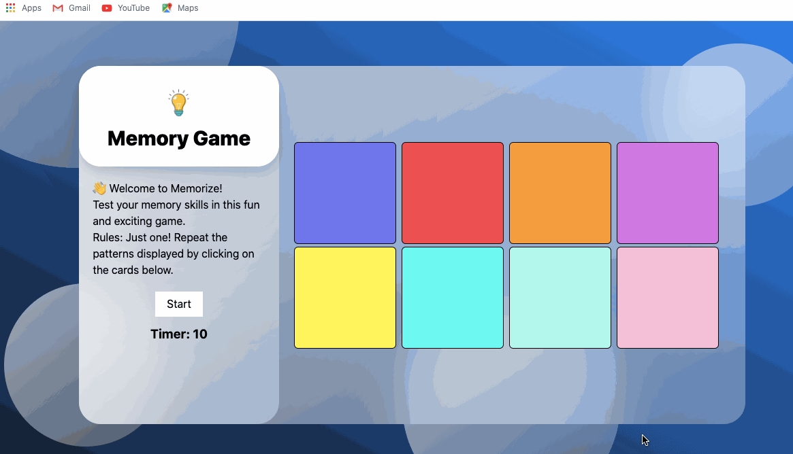
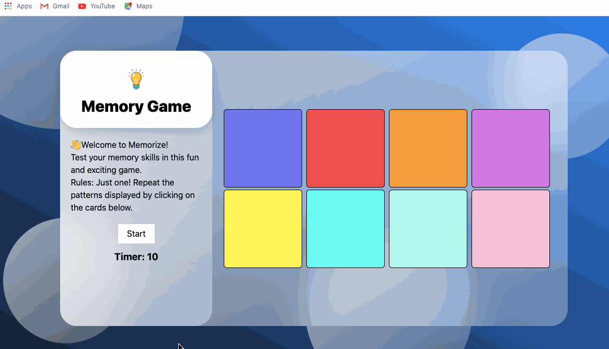

# Pre-work - _Memory Game_

**Memory Game** is a Light & Sound Memory game to apply for CodePath's SITE Program.

Submitted by: **Tewodros Amare**

Time spent: **8** hours spent in total

Link to project: https://glitch.com/edit/#!/accidental-adaptable-fog

## Required Functionality

The following **required** functionality is complete:

- [x] Game interface has a heading (h1 tag), a line of body text (p tag), and four buttons that match the demo app
- [x] "Start" button toggles between "Start" and "Stop" when clicked.
- [x] Game buttons each light up and play a sound when clicked.
- [x] Computer plays back sequence of clues including sound and visual cue for each button
- [x] Play progresses to the next turn (the user gets the next step in the pattern) after a correct guess.
- [x] User wins the game after guessing a complete pattern
- [x] User loses the game after an incorrect guess

The following **optional** features are implemented:

- [x] Any HTML page elements (including game buttons) has been styled differently than in the tutorial
- [x] Buttons use a pitch (frequency) other than the ones in the tutorial
- [x] More than 4 functional game buttons
- [x] Playback speeds up on each turn
- [x] Computer picks a different pattern each time the game is played
- [x] Player only loses after 3 mistakes (instead of on the first mistake)
- [x] Game button appearance change goes beyond color (e.g. add an image)
- [x] Game button sound is more complex than a single tone (e.g. an audio file, a chord, a sequence of multiple tones)
- [x] User has a limited amount of time to enter their guess on each turn

The following **additional** features are implemented:

- [x] Stops playing tone when mouse is released outside the button (onmouseup outisde the element)

## Video Walkthrough

Here's a walkthrough of implemented user stories: 
  -- [Game]

  -- [Responsiveness]

  -- [Timer]

  -- [Mistakes Counter]

## Reflection Questions

1. If you used any outside resources to help complete your submission (websites, books, people, etc) list them here. 
    **https://www.w3schools.com/**
    **https://jsfiddle.net/**
    
2. What was a challenge you encountered in creating this submission (be specific)? How did you overcome it? (recommended 200 - 400 words)  
    The most challenging part of this project would be implementing the timer, specifically where to place the reset setting in the sequence and also resetting the timer once the game ended. Before I started working on the Timer section, I wanted to learn how it actually worked and how it was implemented in different examples. So basically, I had to educate myself on setInterval and clearInterval before I messed up my code. Since I didn’t have any experience using those functions, I practiced in my code editor by simply using two buttons (play and pause) two control the timer. I understood that setInterval took two parameters – a function and an interval (in ms) and the clearInterval cleared the interval/timer set on setInterval. I brought that logic here to the game and implemented it as if it were simply clicking on those two buttons. After implementing the timer, I noticed it didn’t reset once the game ended. So, I created a reset function and called it when the game ended. But then, if I tried to play again, the timer wouldn’t start counting. To fix this, I put log statements on lines that I thought caused the errors. After eliminating the statements, I was able to catch the sections where the timer was supposed to be restarted. I used resources from w3schools and it was very helpful because I could try my logic and ideas in their online code editor before I brought it to the actual game. JS Fiddle was also really helpful to run separate codes to figure out what went wrong and what needed improvements.  

Another challenge I faced was when I clicked on any button (mousedown) and released the mouse (mouseup) outside of the button, the music/tone didn’t stop playing. I figured that I needed to handle the case when I released the mouse outside of that button (element). I copied my button to JS Fiddle and started to see if I could come up with a solution by selecting the element outside of the button (the whole window in this case). I was able to write that function when the tone/music started playing and made it stop whenever the mouse was released.
To conclude, my general approach to solving the errors/challenges was to divide it into small pieces and tackle each one individually. I also learned that I needed to start with small steps.

    
3. What questions about web development do you have after completing your submission? (recommended 100 - 300 words)  
   [YOUR ANSWER HERE]

4. If you had a few more hours to work on this project, what would you spend them doing (for example: refactoring certain functions, adding additional features, etc). Be specific. (recommended 100 - 300 words)  
   [YOUR ANSWER HERE]

## License

    Copyright [Tewodros Amare]

    Licensed under the Apache License, Version 2.0 (the "License");
    you may not use this file except in compliance with the License.
    You may obtain a copy of the License at

        http://www.apache.org/licenses/LICENSE-2.0

    Unless required by applicable law or agreed to in writing, software
    distributed under the License is distributed on an "AS IS" BASIS,
    WITHOUT WARRANTIES OR CONDITIONS OF ANY KIND, either express or implied.
    See the License for the specific language governing permissions and
    limitations under the License.
